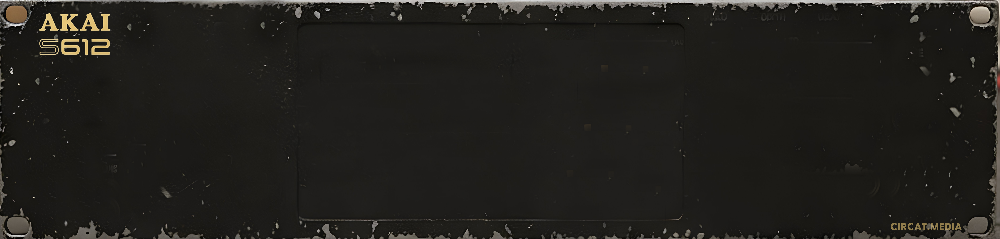

# AKAI S612 Sampler VST3

A faithful hardware emulation of the legendary **Akai S612 Digital Sampler** (1985). This VST3 plugin captures the gritty 12-bit character, unique workflow, and characterful resampling of the original rack unit.

## ✨ Features

- **Authentic 12-Bit Sound:** Every sample is quantized to 12-bit resolution during loading/recording to emulate the original DAC/ADC.
- **Hardware-Style Sample Rates:** Supports 32kHz, 16kHz, and 8kHz operation with characterful linear resampling.
- **Classic Controls:** Manual Splice, Alternating Loop (Hin & Her), and the iconic Start/End faders.
- **MIDI Learn:** Map any MIDI CC to LFO, Filter, Decay, and Start/End points via right-click.
- **Premium UI:** Custom brushed metal skin with original branding.

## 📥 Download

You can find the latest VST3 version in the releases or use the direct link below:

*   **[Download S612 Sampler VST3 (Windows x64)](build/S612Plugin_artefacts/Release/VST3/S612%20Sampler.vst3/Contents/x86_64-win/S612%20Sampler.vst3)**

## 🚀 Installation

1. Copy the `S612 Sampler.vst3` folder/file to your VST3 plug-in directory:
   - **Windows:** `C:\Program Files\Common Files\VST3\`
2. Restart your DAW and rescan your plug-ins.

## 🛠 Usage

- **NEW:** Clears the buffer and enters standby for recording.
- **OVERDUB:** Allows layering on top of existing samples.
- **RATE:** Toggles between the three hardware sample rates (immediately resamples existing audio!).
- **MANUAL SPLICE:** Toggles the manual loop point adjustment mode.
- **MIDI LEARN:** Right-click on any knob or fader to map your hardware controller.

---
*Created by CIRCAT.MEDIA in collaboration with Antigravity AI.*
